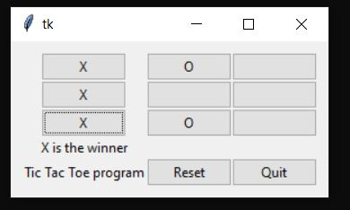

# python-examples

Repo containing pieces of python code used in learning language

Code is experimental unless listed below

### Hello world

`hello.py` is a hello world program using pythonesque message

`hello-tkinter.py` is a hello world that creates a popup window with message and a quit button (run away)

### tic-tac-toe

cd into tic-tac-toe directory and run `python ttt.py`

This creates a simple tic tac toe (naughts and crosses) game with the graphics handled by Tk using the `tkinter` package

The user can click on any square, creating an 'X' and the computer will reply with an 'O'

Limitations
- user can click on a taken square
- difficulty fitting code into MVC pattern

### Other programs to write

##### Backup
Backs up directories to Google drive. Check to see if already backed up before copying. Doesn't delete things
- could be recursive
- simple file system interaction